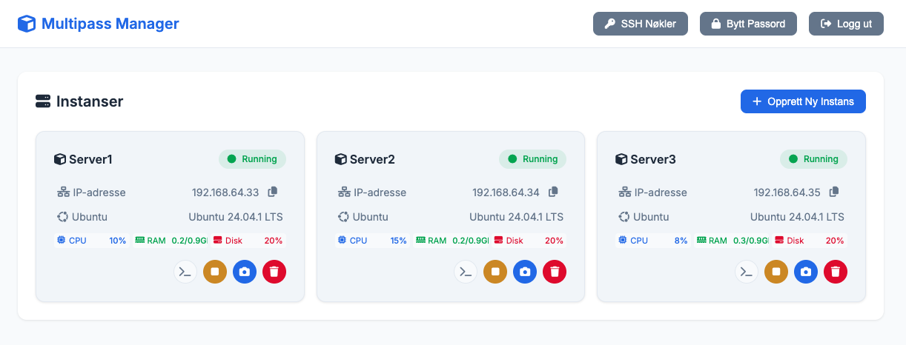
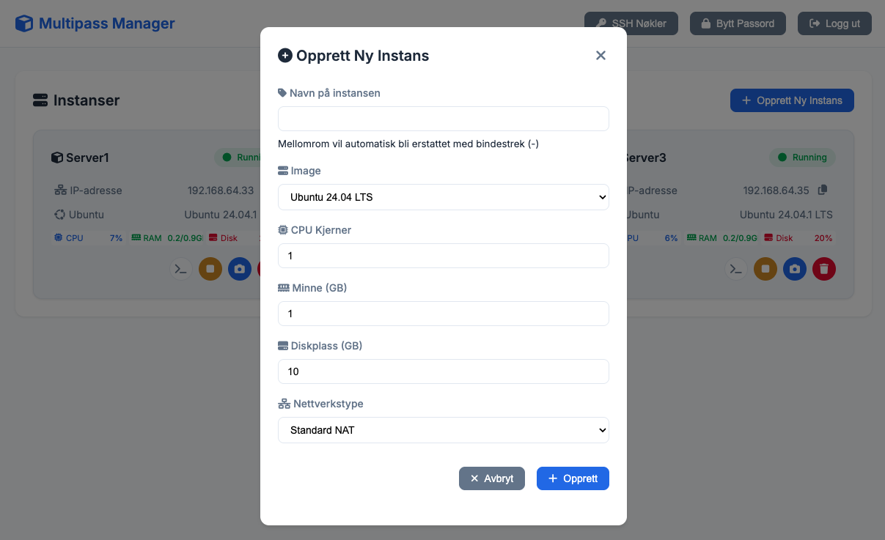

# Multipass Manager

En webbasert administrasjonsgrensesnitt for Ubuntu Multipass.




## Systemkrav

- Ubuntu Server 20.04 LTS eller nyere
- Domenenavn pekende til serveren
- Root-tilgang

## Rask Installasjon

1. Last ned koden:
```bash
git clone https://github.com/frode81/multipass-manager.git
cd multipass-manager
```

2. Kjør installasjonsskriptet:
```bash
chmod +x install.sh
sudo ./install.sh
```

3. Følg instruksjonene i installasjonsskriptet:
   - Skriv inn ditt domenenavn
   - Velg brukernavn og passord for admin-brukeren

Installasjonsskriptet vil automatisk:
- Installere alle nødvendige pakker
- Sette opp Nginx med SSL
- Konfigurere brannmur
- Starte tjenesten

## Manuell Installasjon

Hvis du foretrekker å installere manuelt, se [MANUAL_INSTALL.md](MANUAL_INSTALL.md)

## Vedlikehold

- Sjekk logger: `sudo journalctl -u multipass-manager`
- Restart tjeneste: `sudo systemctl restart multipass-manager`
- Oppdater SSL-sertifikat: `sudo certbot renew`

## Backup

Sikkerhetskopier følgende filer:
- `/opt/multipass-manager/config.json`
- `/etc/nginx/sites-available/multipass-manager.conf`
- `/etc/letsencrypt/`

## Feilsøking

1. Sjekk status på tjenesten:
```bash
sudo systemctl status multipass-manager
```

2. Sjekk Nginx feillogger:
```bash
sudo tail -f /var/log/nginx/error.log
```

3. Sjekk applikasjonslogger:
```bash
sudo journalctl -u multipass-manager -f
```

## Sikkerhet

Applikasjonen er konfigurert med:
- HTTPS/SSL kryptering
- Brannmur (UFW)
- Sikker sesjonshåndtering
- Brukerautentisering

## Oppdateringer

For å oppdatere til nyeste versjon:
```bash
cd /opt/multipass-manager
git pull
sudo npm install
sudo systemctl restart multipass-manager
``` # multipass-manager
